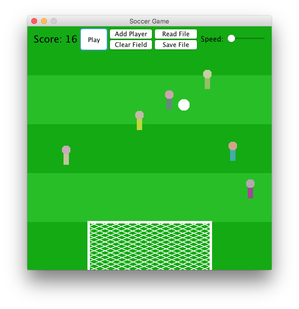
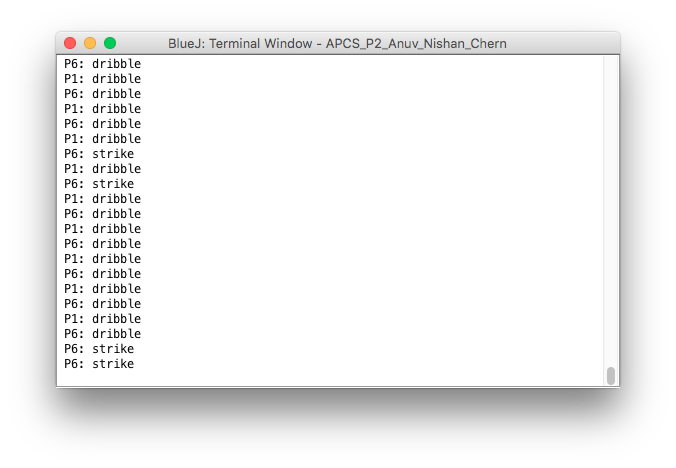
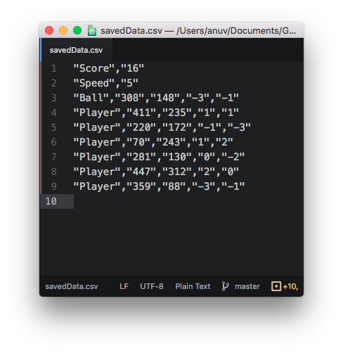

# JWorldCup
- APCS Project

## Purpose
To change and control the state of 10 or more obejcts randomly and save as well as load their variable data to/from a CSV file

## Authors
- [@anuvgupta](https://github.com/anuvgupta/)
- [@nishand17](https://github.com/nishand17/)
- [@wchern](https://github.com/wchern/)

## Version
10/12/2016

## Running this project
Run the `main()` method in the WorldCup class

## Details/Controls
- The window should open with a ball on a field with one goal, but no players
- The game is paused and blank by default
- To RESTORE the game to its "initial" or previous state, click the 'Read File' button
 - It will read the game data from `./savedData.csv`
- To PLAY the game (commence the ball's and players' motion) press the 'Play' button
- To PAUSE the game (halt the ball's and players' motion) press the 'Pause' button
- To ADD players to the game, click the 'Add Player' button
- To CLEAR the players from the screen, click the 'Clear Field' button
- To SPEED up or slow down the animations, move the knob of the 'Speed' slider
- To SAVE the game's current state to `./savedData.csv` click on the 'Save File' button
- To LOAD the game's last saved state from `./savedData.csv`, click on the 'Read File' button
- "Playing/paused" game state is not saved to allow for efficiently reading from the file
- Player jersey/skin colors are not saved, and are randomly generated whenever player is added or loaded
- Saved data includes:
 - All players' positions, and directions/speeds (vectors)
 - Ball position and direction/speed (vector)
 - Current game overall score (total goals scored during game run)
 - Current game animation speed (set by slider)
- NOTE: Due to the inadequacies of javax.swing, the timers that control animations slow drastically
- NOTE: It is recommended that the JVM is reset after terminating the program due to, once again, the inadequacies of `javax.swing`, whose timers may run indefinitely for no reason

## Screenshots of a sample run

